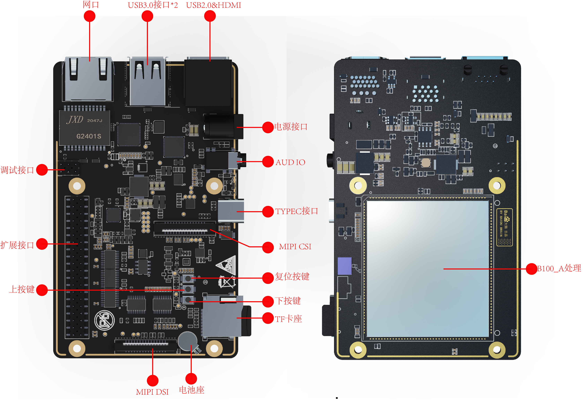
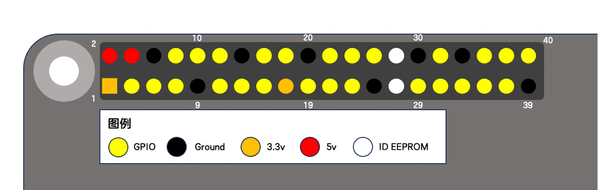

# 接口简介

EdgeBoard DK-1B配置接口丰富。提供40PIN扩展接口（含GPIO、UART、PWM、I2C、SPI）、RJ45网口、USB接口、全尺寸HDMI接口、3.5mm音频接口、MIPI接口的相机/显示屏接口等。

## 40PIN接口

40PIN接口是EdgeBoard DK-1B为方便嵌入式系统项目开发、快速搭建原型机而提供的扩展接口，使用40PIN接口可以方便的接入各种传感器、模块。  

<table>
    <thead>
        <tr>
            <th>WiringPi 编码</th>
            <th>alt1 func</th>
            <th>default func</th>
            <th colspan="2">物理引脚BOARD编码</th>
            <th>default func</th>
            <th>alt1 func</th>
            <th>WiringPi 编码</th>
        </tr>
    </thead>
    <tbody>
        <tr>
            <td></td>
            <td></td>
            <td>3.3V</td>
            <td>1</td>
            <td>2</td>
            <td>5V</td>
            <td></td>
            <td></td>
        </tr>
        <tr>
            <td></td>
            <td></td>
            <td>SDA0</td>
            <td>3</td>
            <td>4</td>
            <td>5V</td>
            <td></td>
            <td></td>
        </tr>
        <tr>
            <td></td>
            <td></td>
            <td>SCL0</td>
            <td>5</td>
            <td>6</td>
            <td>GND</td>
            <td></td>
            <td></td>
        </tr>
        <tr>
            <td>7</td>
            <td>TXD3</td>
            <td>GPIO42</td>
            <td>7</td>
            <td>8</td>
            <td>TXD0</td>
            <td>GPIO19</td>
            <td></td>
        </tr>
        <tr>
            <td></td>
            <td></td>
            <td>GND</td>
            <td>9</td>
            <td>10</td>
            <td>RXD0</td>
            <td>GPIO18</td>
            <td></td>
        </tr>
        <tr>
            <td>0</td>
            <td></td>
            <td>GPIO8</td>
            <td>11</td>
            <td>12</td>
            <td>GPIO38</td>
            <td>PWM1</td>
            <td>1</td>
        </tr>
        <tr>
            <td>2</td>
            <td></td>
            <td>GPIO9</td>
            <td>13</td>
            <td>14</td>
            <td>GND</td>
            <td></td>
            <td></td>
        </tr>
        <tr>
            <td>3</td>
            <td></td>
            <td>GPIO10</td>
            <td>15</td>
            <td>16</td>
            <td>GPIO37</td>
            <td></td>
            <td>4</td>
        </tr>
        <tr>
            <td></td>
            <td></td>
            <td>3.3V</td>
            <td>17</td>
            <td>18</td>
            <td>GPIO36</td>
            <td></td>
            <td>5</td>
        </tr>
        <tr>
            <td></td>
            <td></td>
            <td>SPI1_SDO</td>
            <td>19</td>
            <td>20</td>
            <td>GND</td>
            <td></td>
            <td></td>
        </tr>
        <tr>
            <td></td>
            <td></td>
            <td>SPI1_SDI</td>
            <td>21</td>
            <td>22</td>
            <td>GPIO40</td>
            <td></td>
            <td>6</td>
        </tr>
        <tr>
            <td></td>
            <td></td>
            <td>SPI1_SCLK</td>
            <td>23</td>
            <td>24</td>
            <td>SPI1_CS0</td>
            <td></td>
            <td></td>
        </tr>
        <tr>
            <td></td>
            <td></td>
            <td>GND</td>
            <td>25</td>
            <td>26</td>
            <td>SPI1_CS1</td>
            <td></td>
            <td></td>
        </tr>
        <tr>
            <td></td>
            <td></td>
            <td>SDA3</td>
            <td>27</td>
            <td>28</td>
            <td>SCL3</td>
            <td></td>
            <td></td>
        </tr>
        <tr>
            <td>21</td>
            <td>RXD3</td>
            <td>GPIO43</td>
            <td>29</td>
            <td>30</td>
            <td>GND</td>
            <td></td>
            <td></td>
        </tr>
        <tr>
            <td>22</td>
            <td></td>
            <td>GPIO12</td>
            <td>31</td>
            <td>32</td>
            <td>PWM0</td>
            <td>GPIO39</td>
            <td>26</td>
        </tr>
        <tr>
            <td>23</td>
            <td>GPIO16</td>
            <td>PWM2</td>
            <td>33</td>
            <td>34</td>
            <td>GND</td>
            <td></td>
            <td></td>
        </tr>
        <tr>
            <td>24</td>
            <td>PWM3</td>
            <td>GPIO15</td>
            <td>35</td>
            <td>36</td>
            <td>GPIO41</td>
            <td></td>
            <td>27</td>
        </tr>
        <tr>
            <td>25</td>
            <td></td>
            <td>GPIO13</td>
            <td>37</td>
            <td>38</td>
            <td>GPIO21</td>
            <td></td>
            <td>28</td>
        </tr>
        <tr>
            <td></td>
            <td></td>
            <td>GND</td>
            <td>39</td>
            <td>40</td>
            <td>GPIO11</td>
            <td></td>
            <td>29</td>
        </tr>
    </tbody>
</table>