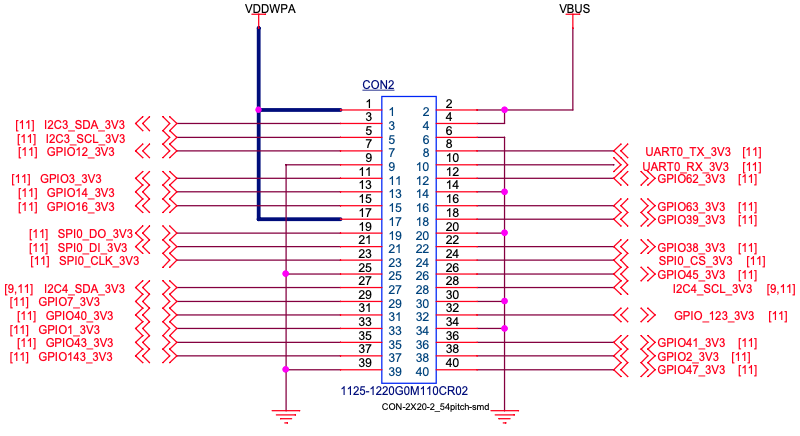

# 接口简介


EdgeBoard DK-1B配置接口丰富。提供40PIN扩展接口（含GPIO、UART、PWM、I2C、SPI）、RJ45网口、USB接口、全尺寸HDMI接口、3.5mm音频接口、MIPI接口的相机/显示屏接口等。

## 40PIN接口

40PIN接口是EdgeBoard DK-1B为方便嵌入式系统项目开发、快速搭建原型机而提供的扩展接口，使用40PIN接口可以方便的接入各种传感器、模块。  




### 方案简介

#### libgpiod方案

libgpiod用于与Linux GPIO设备互动的C语言库和工具。 Linux提供了一种访问GPIO控制器的字符设备接口，通过操作字符设备文件（比如 /dev/gpiodchip0 ）实现的， 并通过libgpiod提供一些命令工具、c库以及python封装。

#### libserial

LibSerial提供了一种方便的、面向对象的方法来访问Linux操作系统上的串行端口。 Ubuntu源提供的libserial安装包存在问题，直接使用apt安装的库无法使用，可以参考[官方源码](https://github.com/crayzeewulf/libserial)编译的方式使用。板卡系统自1.3版本起，默认已经编译安装了正确的版本。  

### libgpiod

#### 安装

打开终端，输入以下命令安装libgpiod库。

```shell
#安装libgpiod库及头文件
sudo apt install libgpiod-dev 
#安装gpiod 命令行工具
sudo apt install gpiod
```

#### 使用

参考[libgpiod源码](https://github.com/starnight/libgpiod)和[官方示例](https://github.com/starnight/libgpiod-example)。  

板卡提供的GPIO扩展，使用的是/dev/gpiodchip4，对应GPIO端口号参考上文原理图图示，如：GPIO43_3V3表示端口号为43，支持电源3.3v。  
